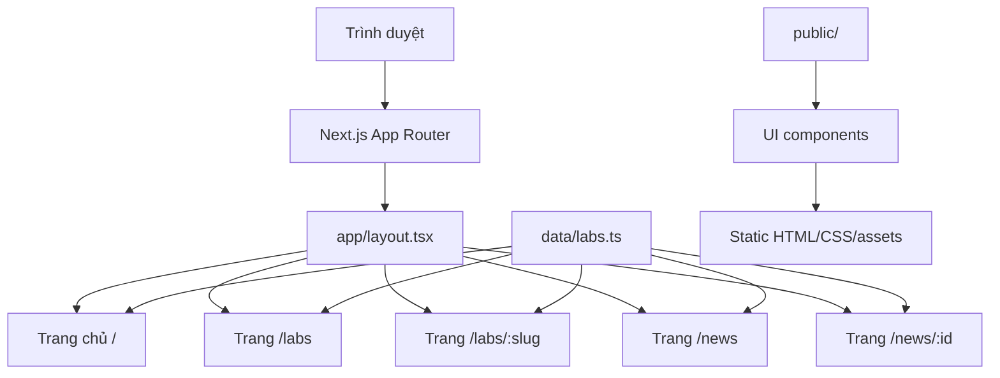

# Tài liệu kỹ thuật — Tech-Convergence Hub

## 1. Mục đích và phạm vi

Tech-Convergence Hub (TCH) là website giới thiệu mô hình phòng thí nghiệm, công nghệ, đối tác và tin tức của UEH. Dự án hiện được triển khai như một website nội dung tĩnh bằng Next.js App Router:

- Giao diện responsive, ngôn ngữ hiển thị chính là tiếng Việt.
- Dữ liệu lab và news được khai báo tĩnh trong mã nguồn.
- Các trang được sinh tĩnh khi build, không có API runtime hoặc cơ sở dữ liệu.
- Có hỗ trợ deploy dưới subpath GitHub Pages thông qua `basePath`.

Tài liệu này mô tả kiến trúc hiện tại trong repository, cách chạy, luồng dữ liệu, quy ước tài sản và các giới hạn cần biết khi phát triển tiếp.

## 2. Công nghệ sử dụng

| Nhóm | Công nghệ | Vai trò |
|---|---|---|
| Framework | Next.js 15.5.19 | App Router, static export, metadata và routing |
| UI | React 19.2.7 | Component giao diện |
| Ngôn ngữ | TypeScript 5.9.3 | Kiểu dữ liệu và biên dịch |
| CSS | CSS thuần trong `app/globals.css` | Design system, layout và responsive |
| Animation | GSAP 3.15.0 | Đã cài nhưng chưa được import/tích hợp vào giao diện |
| Image pipeline | Sharp 0.35.3 | Công cụ thử nghiệm sinh biến thể ảnh lab |
| Font | iCiel Gotham local | Font chính của website |
| Lint/build | ESLint 9, `eslint-config-next` 15.5.19 | Dependency kiểm tra chất lượng; script lint hiện chưa cấu hình hoàn chỉnh |

Các phiên bản trên là phiên bản đang được khóa trong `package-lock.json`; khoảng phiên bản khai báo trong `package.json` có thể rộng hơn.

## 3. Cấu trúc thư mục

```text
app/
  layout.tsx              # Root layout, font, metadata, ScrollToTop
  page.tsx                # Trang chủ /
  globals.css             # CSS toàn cục và responsive rules
  labs/page.tsx           # Danh mục labs
  labs/[slug]/page.tsx    # Chi tiết một lab
  news/page.tsx           # Danh sách tin tức
  news/[id]/page.tsx      # Chi tiết một tin
components/               # Component dùng lại cho các route
data/labs.ts              # Type và dữ liệu labs/news
public/                   # Ảnh, logo, font và tài nguyên tĩnh
scripts/                  # Script xử lý/generate tài sản
lib/                      # Hiện chưa có helper dùng chung
next.config.ts            # Static export, base path và webpack watch
package.json              # Scripts và dependencies
```

Các thư mục `app/admin` và `app/api/admin` hiện chưa có implementation route thực tế. Không nên xem đây là module quản trị/API đã hoạt động.

## 4. Kiến trúc tổng thể



Root layout áp dụng font local, metadata chung, CSS variables cho ảnh tiêu đề và component `ScrollToTop`. Mỗi route ghép các component trình bày, trong đó dữ liệu được import trực tiếp từ `data/labs.ts`.

## 5. Các route và hành vi

### 5.1. Trang chủ `/`

`app/page.tsx` render theo thứ tự:

1. `Header` — điều hướng chính và trạng thái header theo route/cuộn.
2. `Hero` — khu vực mở đầu.
3. `VisionSection` — nội dung định hướng.
4. `OrbitMap` — bản đồ labs có bộ lọc theo tầng và thống kê số cụm/chức năng của tầng đang chọn.
5. `PartnerMarquee` — dải logo đối tác chạy ngang.
6. `Footer` — thông tin cuối trang.

### 5.2. Danh mục labs `/labs`

Trang gồm `Header`, `ProjectSideNav`, `ProjectIntroStrip` và `LabDirectory`. `LabDirectory` duyệt mảng `labs`, hiển thị tên, mô tả, tầng/phòng, công nghệ và ảnh card. Mỗi card liên kết tới `/labs/{id}`.

### 5.3. Chi tiết lab `/labs/[slug]`

- `generateStaticParams()` tạo route cho toàn bộ `labs` dựa trên `lab.id`.
- `generateMetadata()` tạo title/description theo lab.
- Lab không tồn tại sẽ gọi `notFound()`.
- Nội dung gồm ảnh hero, thông tin phòng/tầng/cụm, công nghệ, lĩnh vực ứng dụng, năng lực, đầu ra, đối tượng phù hợp và các lab cùng cụm.
- Ảnh được prefix bằng `NEXT_PUBLIC_BASE_PATH` để hoạt động khi deploy dưới subpath.

### 5.4. Danh sách news `/news`

Trang dùng `NewsSection` để hiển thị dữ liệu `news` và liên kết đến trang chi tiết theo chỉ số 1-based.

### 5.5. Chi tiết news `/news/[id]`

- `generateStaticParams()` sinh id từ `1` đến số lượng phần tử trong `news`.
- `id` được chuyển thành index bằng `Number(id) - 1`.
- Id không hợp lệ hoặc vượt phạm vi sẽ gọi `notFound()`.
- Metadata được tạo theo title và excerpt của item.

## 6. Mô hình dữ liệu và luồng dữ liệu

File `data/labs.ts` là nguồn dữ liệu trung tâm, gồm các thành phần chính:

- `LabVisual` — thông tin ảnh card/detail/ảnh thật của lab.
- `Lab` — định danh, tên, mô tả, tầng, phòng, cụm, công nghệ, ứng dụng và nội dung bổ sung.
- `NewsItem` — category, date, title và excerpt của tin.
- `floorLabels` — map nhãn hiển thị cho tầng.
- `labs` — danh sách lab hoàn chỉnh.
- `news` — danh sách tin tĩnh.

Các helper dữ liệu quan trọng:

- `buildLabVisual` gán ảnh cho từng lab theo id.
- `taoLab` tạo object lab và điền các giá trị mặc định như audiences, outcomes, capabilities, intro và quote.
- `assertUniqueLabVisuals` kiểm tra ảnh card/detail không bị dùng trùng giữa các lab.

Luồng xử lý chính:

```text
data/labs.ts
   ├── labs -> LabDirectory -> card -> /labs/[slug]
  ├── labs -> OrbitMap -> lọc theo tầng, thống kê theo cụm
   ├── labs -> labs/[slug] -> static params + detail
   └── news -> NewsSection -> /news/[id] -> static detail
```

Khi thêm lab, cần cập nhật dữ liệu và tự bảo đảm mapping ảnh trỏ tới file tồn tại. `assertUniqueLabVisuals` chỉ phát hiện path `cardImage` hoặc `detailImage` bị trùng; hàm này không kiểm tra file có tồn tại và không kiểm tra `realImage` bị thiếu/trùng.

## 7. Component và trạng thái phía client

Phần lớn component là server component mặc định. Các component cần browser state/effect được đánh dấu client, nổi bật là:

- `Header`: dùng pathname, scroll listener và đo vùng hero/media để chuyển trạng thái overlay/solid.
- `OrbitMap`: dùng state để chọn tầng và memoization để tính các nhóm lab.
- `PartnerMarquee`: nhân bản dữ liệu logo để tạo marquee vô hạn; hàng thứ hai chạy ngược chiều.
- `ScrollToTop`: chỉ hiện sau khi người dùng cuộn quá ngưỡng và đưa trang về đầu khi click.

Điều hướng dùng `next/link`. Không có state management toàn cục, server action, form submission hoặc client-side data fetching trong implementation hiện tại.

## 8. Tài sản tĩnh và ảnh

Tài sản public được phục vụ từ thư mục `public/` và tham chiếu bằng URL bắt đầu từ root hoặc có prefix base path. Các nhóm chính:

- `public/lab-images/` — ảnh card/detail và ảnh lab.
- `public/logos/` — logo UEH, đối tác và ảnh nhận diện.
- `public/fonts/` — font local iCiel Gotham.
- `public/CTD/` — tài sản liên quan CTD.

`next.config.ts` đặt `images.unoptimized: true`, phù hợp với static export nhưng đồng nghĩa Next Image Optimization server không được sử dụng.

### Sinh ảnh lab

Giao diện hiện ưu tiên `visual.realImage`; map `realLabImages` trong `data/labs.ts` trỏ các lab tới bộ ảnh số `1.jpg`–`35.jpg` trong `public/lab-images/`. Nếu `realImage` không có, UI mới fallback sang `cardImage` hoặc `detailImage`.

`scripts/generate-lab-images.mjs` là script thử nghiệm dùng Sharp, SVG overlay và palette theo seed để tạo `lab-card-01.jpg`–`lab-card-35.jpg` cùng bộ `lab-detail-01.jpg`–`lab-detail-35.jpg`. Pipeline này **chưa hoạt động với repository hiện tại** vì:

- Script yêu cầu ảnh nguồn `tech-01.jpg`–`tech-13.jpg`, nhưng các file này không có trong `public/lab-images/`.
- Script xuất tên file theo số thứ tự, trong khi `buildLabVisual` tạo fallback path theo slug như `lab-card-{lab-id}.jpg`.
- Script chưa được khai báo thành npm script.

Không chạy hoặc coi script này là pipeline production cho đến khi đã bổ sung ảnh nguồn và đồng bộ quy ước tên file với `data/labs.ts`.

## 9. Cấu hình build và deploy

`next.config.ts` có các thiết lập:

- `output: "export"` — xuất website tĩnh.
- `images.unoptimized: true` — tương thích static hosting.
- `basePath: "/Tech-Convergence-Hub"` khi `GITHUB_ACTIONS === "true"`, ngược lại là chuỗi rỗng.
- `assetPrefix` được đặt tương ứng khi có base path.
- `NEXT_PUBLIC_BASE_PATH` được expose để code tạo URL ảnh/icon đúng môi trường.
- `webpack.watchOptions.ignored` loại trừ một số file hệ thống Windows và `node_modules` khi watch.

Khi deploy GitHub Pages, cần bảo đảm repository/project path đúng với `repoName` trong config. Nếu đổi tên repository, phải cập nhật giá trị này trước khi build.

Workflow `.github/workflows/deploy-pages.yml` thực hiện quy trình deploy chính thức:

1. Chạy trên push vào nhánh `main` hoặc khi kích hoạt thủ công.
2. Thiết lập Node.js 20 và cài dependency bằng `npm ci`.
3. Build với `GITHUB_ACTIONS="true"`, vì vậy output sử dụng base path `/Tech-Convergence-Hub`.
4. Tạo `out/.nojekyll`.
5. Upload thư mục `out/` và deploy bằng GitHub Pages Actions.

Build local thông thường không có base path. Nếu cần mô phỏng chính xác đường dẫn của GitHub Pages, phải build với `GITHUB_ACTIONS="true"` và phục vụ output dưới đúng subpath.

## 10. Responsive và chuyển động

Các breakpoint chính trong `app/globals.css`:

- `min-width: 1280px` — điều chỉnh layout cho màn hình lớn.
- `max-width: 1080px` — layout tablet/laptop nhỏ.
- `max-width: 740px` — layout mobile.
- `prefers-reduced-motion: reduce` — giảm hoặc tắt chuyển động theo thiết lập accessibility của hệ điều hành.

## 11. Biến môi trường

| Biến | Bắt buộc | Ý nghĩa |
|---|---:|---|
| `GITHUB_ACTIONS` | Không | Khi bằng `"true"`, bật base path GitHub Pages |
| `NEXT_PUBLIC_BASE_PATH` | Không tự khai báo | Được Next config inject từ `basePath`, dùng khi dựng URL asset |

Không có biến kết nối database, CMS, authentication hay API bên ngoài được sử dụng trong mã nguồn hiện tại. Không commit secret vào `.env.local` hoặc repository.

## 12. Cài đặt và chạy local

Yêu cầu Node.js 20.9.0 trở lên và npm. Mức tối thiểu này được chọn theo yêu cầu của Sharp 0.35.3 trong lockfile; workflow deploy đang dùng Node.js 20.

```bash
npm install
npm run dev
```

Mở `http://localhost:3000`.

Các lệnh có sẵn:

| Lệnh | Mục đích |
|---|---|
| `npm run dev` | Chạy development server |
| `npm run build` | Kiểm tra TypeScript/Next và tạo static export trong `out/` |
| `npm run start` | Có trong `package.json` nhưng không phù hợp với `output: "export"`; không dùng để phục vụ bản build này |
| `npm run lint` | Hiện gọi `next lint`, đang deprecated và mở prompt cấu hình do repository chưa có ESLint config |

Để preview bản production, build rồi phục vụ thư mục `out/` bằng một static file server thay vì `next start`. Script lint cần được migrate sang ESLint CLI và thêm file cấu hình trước khi dùng trong CI.

Quy trình kiểm tra đề xuất trước khi merge:

1. `npm install` hoặc `npm ci`.
2. Chạy lint sau khi repository đã được cấu hình ESLint CLI; ở trạng thái hiện tại `npm run lint` chưa chạy unattended được.
3. Chạy `npm run build`.
4. Kiểm tra thủ công `/`, `/labs`, một route `/labs/{slug}`, `/news` và một route `/news/{id}`.
5. Nếu deploy dưới subpath, kiểm tra các ảnh/logo/font không bị 404.

## 13. Quy trình cập nhật nội dung

### Thêm hoặc sửa lab

1. Cập nhật object trong `data/labs.ts`.
2. Bảo đảm `id` là duy nhất và URL-safe vì được dùng làm slug.
3. Thêm ảnh vào `public/lab-images/` và cập nhật `realLabImages` theo `id`; nếu không dùng `realImage`, phải tự cung cấp đúng file fallback theo slug mà `buildLabVisual` tạo ra.
4. Kiểm tra file thực sự tồn tại và không dùng trùng ảnh với lab khác; kiểm tra tự động hiện chỉ bao phủ trùng path card/detail.
5. Chạy lint/build và kiểm tra cả card lẫn trang detail.

### Thêm news

1. Thêm item vào mảng `news` trong `data/labs.ts`.
2. Giữ đủ category, date, title và excerpt.
3. Nhớ rằng URL detail dùng index 1-based, nên thay đổi thứ tự mảng sẽ thay đổi URL của các tin cũ.
4. Chạy build để xác nhận static params và kiểm tra route chi tiết.

## 14. Giới hạn kỹ thuật và hướng phát triển

### Giới hạn hiện tại

- Nội dung hard-code trong TypeScript, chưa có CMS hoặc database.
- Không có API/admin/authentication đang hoạt động.
- URL news dựa trên index nên không ổn định khi sắp xếp hoặc xóa item.
- `Header` có danh sách nav riêng, trong khi một số component khác dùng `siteNavItems`; đây là điểm có thể gây lệch menu khi cập nhật.
- `lib/` chưa có lớp abstraction cho data access hoặc asset URL.
- Static export không phù hợp với các tính năng cần server runtime, API động hoặc ISR.
- `npm run start` không phục vụ được output tĩnh theo mô hình hiện tại; cần static file server/hosting.
- `npm run lint` còn dùng `next lint` deprecated và chưa có cấu hình ESLint chạy unattended.
- Script generate ảnh chưa khớp với ảnh nguồn và quy ước tên file mà UI đang dùng.

### Hướng phát triển đề xuất

1. Tách type, validator và repository dữ liệu khỏi `data/labs.ts` khi dữ liệu tăng.
2. Dùng slug ổn định cho news thay cho index số.
3. Hợp nhất toàn bộ menu vào `siteNavItems`.
4. Đồng bộ input/output của `generate-lab-images.mjs` với `data/labs.ts`, sau đó mới thêm npm script.
5. Bổ sung test cho mapping ảnh, id/slug và dữ liệu bắt buộc.
6. Nếu cần quản trị nội dung, chọn CMS/database và chuyển từ static-only sang mô hình có server runtime phù hợp.
7. Bổ sung kiểm tra accessibility, SEO canonical/OG image và kiểm thử visual trên các breakpoint.

## 15. Checklist phát hành

- [ ] Dữ liệu mới có id/slug duy nhất.
- [ ] Tất cả asset được commit đúng thư mục `public/`.
- [ ] Không có secret trong file được commit.
- [ ] ESLint CLI đã được cấu hình và lint hoàn tất; không dựa vào prompt tương tác của `next lint`.
- [ ] `npm run build` hoàn tất.
- [ ] Các route detail hợp lệ sinh được khi build.
- [ ] Không có lỗi 404 asset ở local và GitHub Pages.
- [ ] Responsive được kiểm tra ở desktop, tablet và mobile.
